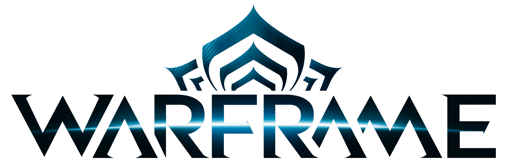

# Algorithmic Trading-App for Warframe



## Overview

The Algorithmic Trading-App for Warframe is a powerful tool designed to help players optimize their in-game trading experience within the popular online game, Warframe. Leveraging the Warframe Market API, this app aims to provide players with real-time market data and intelligent algorithms to identify and create the best deals for their in-game items.

## Features

-   **Real-Time Market Data**: The app fetches up-to-date market information from the Warframe Market API, ensuring that you have the latest pricing and demand trends at your fingertips.

-   **Deal Optimization**: Our algorithms analyze market data to identify potential trading opportunities, including items with high demand, low supply, and favorable price differences.

-   **User-Friendly Interface**: A clean and intuitive interface makes it easy to browse the market, view item details, and execute trades effortlessly.

-   **Customizable Alerts**: Set up alerts for specific items or price ranges to receive notifications when lucrative trading opportunities arise.

-   **Secure Trading**: The app provides a secure platform for trading in-game items, protecting both buyers and sellers from potential scams.

## Getting Started

1. Clone the repository to your local machine:

    ```bash
    git clone https://github.com/your-username/warframe-trading-app.git
    ```
